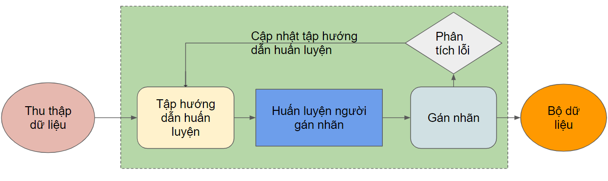
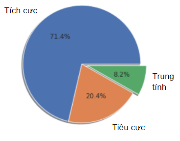
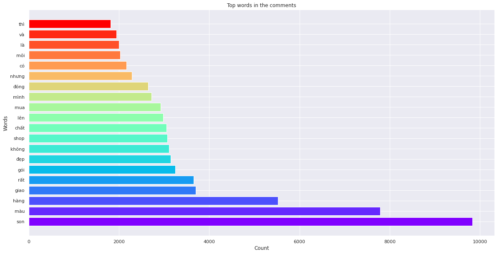
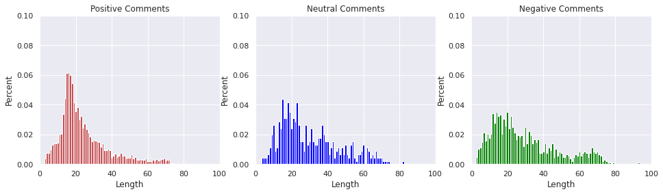

# DS202 / Data science thesis 1

## About

* This is a college course project about collecting social data from Internet for for NLP emotion classification task.
* Techniques applied:
> * Data collection and cleaning
> * Annotation guildlines
> * Word tokenization, Deep learning models

## Table of contents

> * [DS200.L21 / Big data](#ds202--data-science-thesis-1)
* [About](#about)
* [Table of contents](#table-of-contents)
* [Data source](#data-source)
* [Experiment pipelines](#experiment-pipelines)
* [Data details](#data-details)
* [Code](#code)
* [Presentation slides and Report](#presentation-slides-and-report)
* [References](#references)

## Data source

* <a href="https://github.com/githubbinh/DS202_Data-Science-thesis-1/tree/main/raw_data" target="_blank">Raw data</a>
* <a href="https://github.com/githubbinh/DS202_Data-Science-thesis-1/tree/main/processed_data" target="_blank">Clean data</a>

## Experiment pipelines

## Data details
* Label distribution

* Word count

* Comment length distribution over labels

* Annotation agreement results over 5 rounds

## Code

* Feature extraction and models training (and so on) in this repo are implemented in Google Colab.
* All codes are organized in `name.ipynb` files.

## Presentation slides and Report

* <a href="https://github.com/githubbinh/DS202_Data-Science-thesis-1/blob/main/slides_UITVLFC.pptx" target="_blank">Report slides</a>
* <a href="https://github.com/githubbinh/DS202_Data-Science-thesis-1/blob/main/report_UIT-VLFC.pdf" target="_blank">Report</a>
* <a href="https://github.com/githubbinh/DS202_Data-Science-thesis-1/blob/main/guildlines_UITVLFC.pdf" target="_blank">Guildlines</a>

## References

* All references are cited in the report file.

e